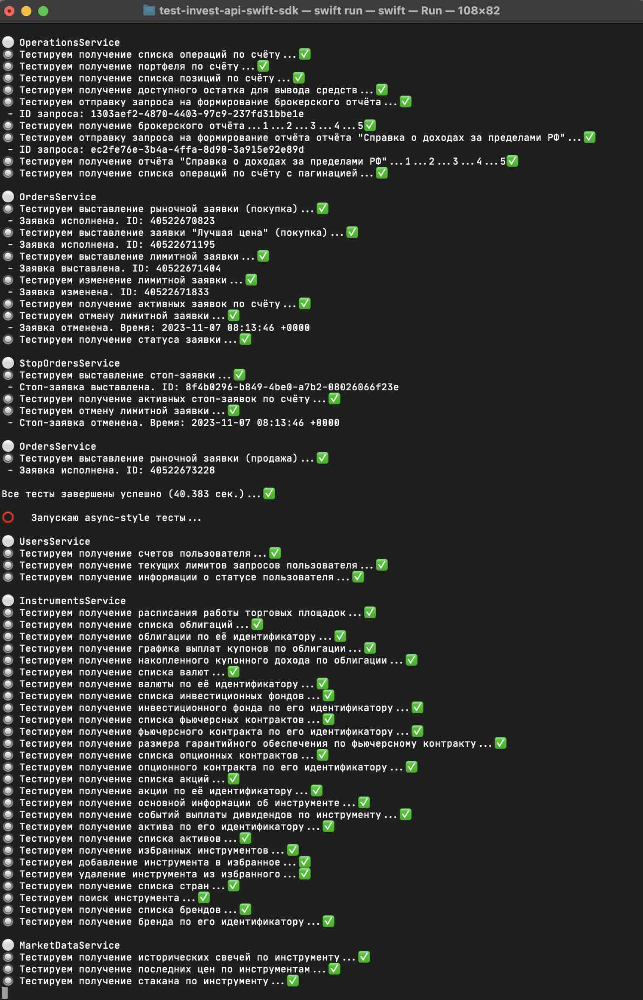

# TestInvestApiSwiftSdk

<p align="center">
    <a href="LICENSE">
        
    </a>
    <a href="https://swift.org">
        
    </a>
</p>

TestInvestApiSwiftSdk - утилита командной строки для тестирования [InvestApiSwiftSdk](https://github.com/egorbos/invest-api-swift-sdk).

### Пример использования

Если у Вас не установлен язык программирования Swift, воспользуйтесь [инструкцией по установке](https://www.swift.org/install).

```
git clone https://github.com/egorbos/test-invest-api-swift-sdk.git
или ssh
git clone git@github.com:egorbos/test-invest-api-swift-sdk.git
cd test-invest-api-swift-sdk
swift build
swift run
```

Для тестирования выставления заявок, так же необходимо иметь денежные средства на брокерском счёте, в размере стоимость 1 пая ETF `TRUR` * 2 + несколько рублей.

